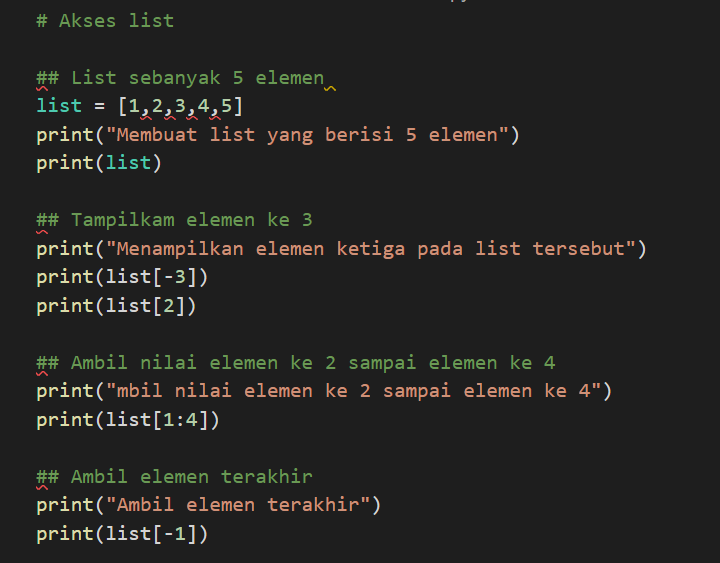
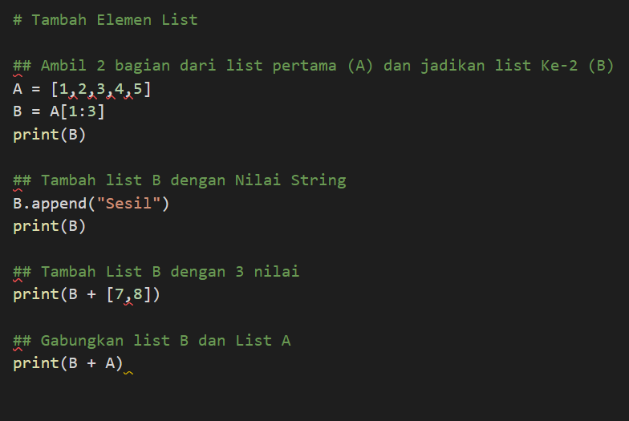
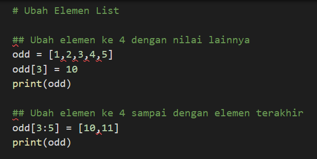
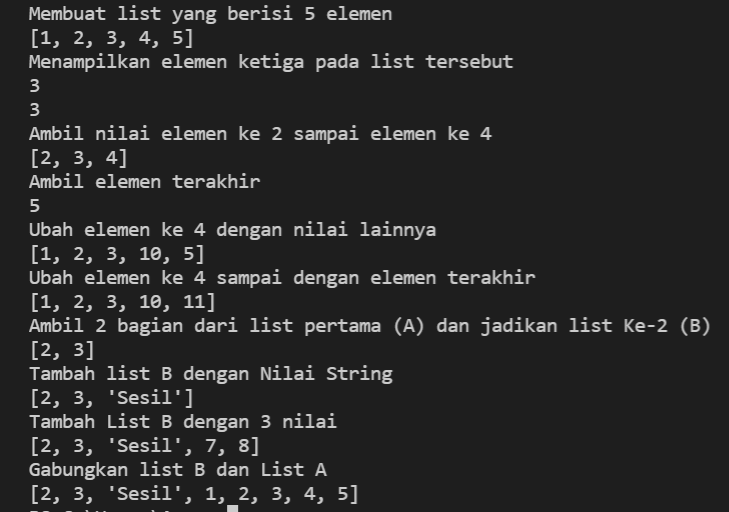
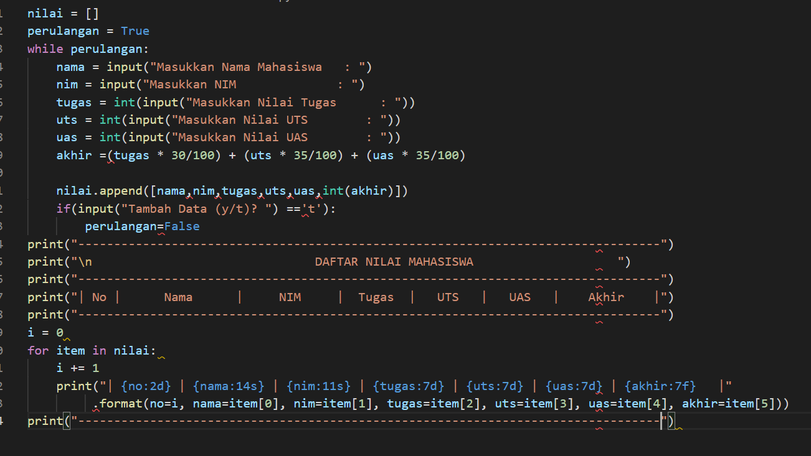
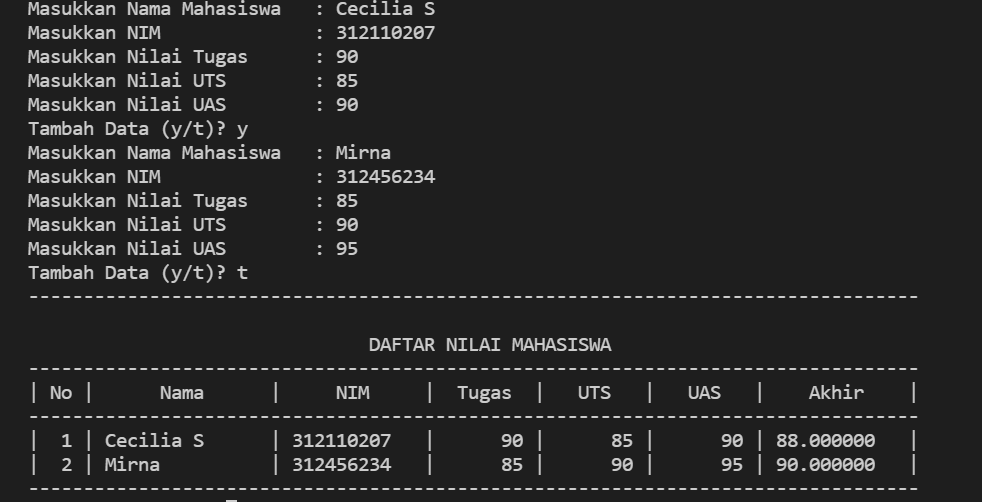
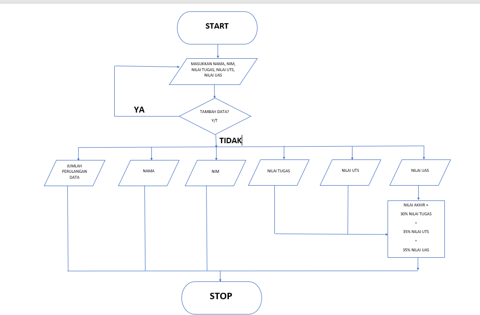

# Praktikum4

## Latihan

### Program 

#### Akses List

#### Ubah Elemen List

#### Tambah Elemen List

### Output

## Praktikum

### Program
Scriptnya seperti ini

Terlebih dahulu input nama, nim, nilai tugas, nilai uts, dan nilai uas. Program ini menggunakan looping (perulangan), maka kamu bisa menginput data sebanyak yang kamu mau.
Lalu nilai akhir akan muncul dengan presentase 30% nilai tugas, 35% nilai uts dan 35% nilai uts. Jika masih ingin menginput data input y, namun jika tidak input 't'.
Akhirnya akan muncul seperti format tabel.

Outputnya seperti ini :

### Flowchart

